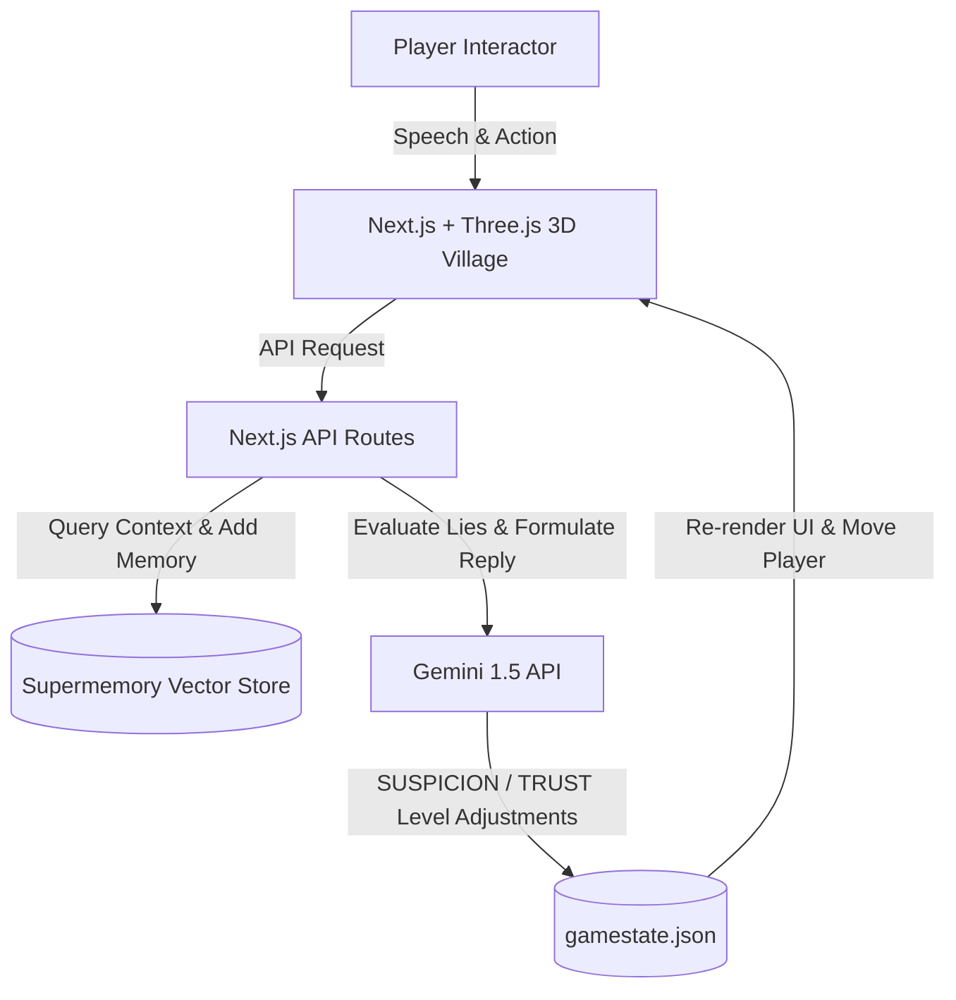
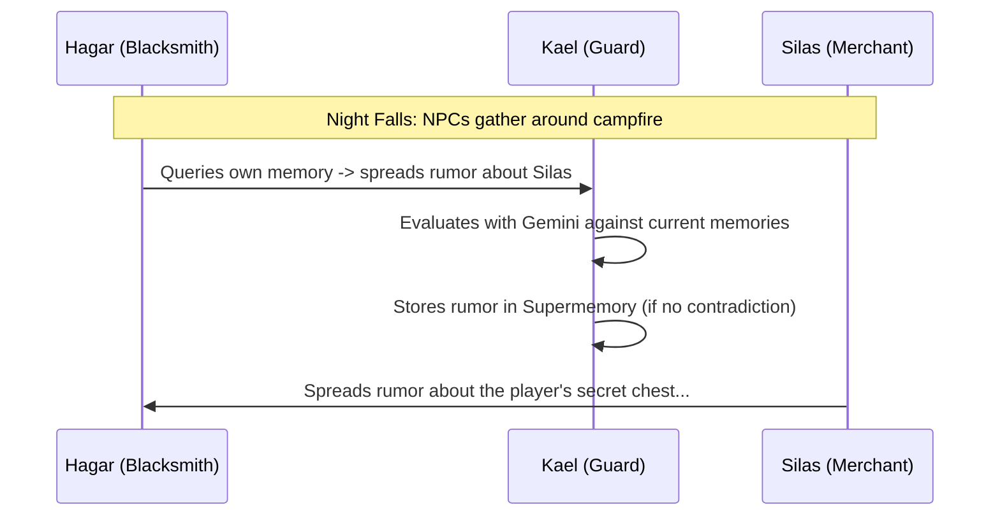

# 🌌 Echoes: The AI Gossip & Contradiction RPG

<div align="center">
  
  
  
  
  

  <p align="center">
    <strong>A Living 3D Social Simulation Driven by LLM Agents with Selective Vector Memory</strong>
  </p>
  
  <sub>Built for the <b>localhost6767</b> Hackathon by Supermemory</sub>
</div>

---

## 🎮 The Concept

**Echoes** is a retro-cyber RPG simulator set in an isolated mountain village. You play as an outsider who must navigate a complex web of trust, secrets, and relationships.

But the villagers aren't static script boxes. **They remember.** They talk to each other. And they will catch you in your lies.

Using the **Supermemory API** as the long-term cognitive storage and **Google Gemini** as the reasoning engine, the NPCs write, search, and delete memories dynamically. Your primary weapon is **gossip**—but spread a contradiction, and the guard will lock you up!

---

## 🛠️ Tech Stack & Architecture



### Core Technologies:
1. **Frontend**: Next.js 16 (App Router), React, TailwindCSS, custom CRT Retro Scanline overlays.
2. **3D World**: Three.js WebGL canvas displaying a fully active, dynamic cartoon town with custom player movement, NPC meshes, chimney smoke particle trails, and interactive buildings.
3. **Cognitive Storage**: **Supermemory API** acting as the vector database for NPC long-term memory.
4. **AI Brains**: Google Gemini 1.5 Pro & Flash for real-time conversation grounding and logical contradiction analysis.

---

## 🧠 Supermemory API Integration: Deep Dive

This project utilizes the Supermemory API to its absolute limit, turning standard CRUD database operations into interactive gameplay loops:

### 📁 1. Cognitive Partitioning (`POST /v3/documents`)
Each NPC has their own vector tag formatted as `${npcId}_${sessionId}`.
Every conversation log, rumor, or major event is stored in Supermemory as a permanent document.

### 🔍 2. Semantic Memory Retrieval (`POST /v4/profile`)
When the player addresses an NPC, the system searches the NPC's profile database using the `q` query parameter. This retrieves:
- **Static Background Core Facts**: Initial seed files detailing the lore.
- **Dynamic Facts**: Spontaneous rumors or facts they acquired from other NPCs.
- **Context Matches**: Directly matching vector fragments to feed to Gemini.

### 🧪 3. Memory Wipe Potions (`DELETE /v3/documents/:id`)
If you make a mistake and leak a rumor that could get you caught, you can buy a **Memory Wipe Potion** using in-game gold.
- This queries their Supermemory tag, retrieves the documents, and exposes the specific records to the player.
- Selecting a memory and wiping it executes a `DELETE` request directly to the Supermemory database ID.
- The NPC literally forgets the event, letting you clear your contradiction trail!

---

## 🔄 The Gossip Protocol

When the day ends (activated by sleeping at the campfire), the **Gossip Protocol** begins:



Rumors drift organically through the village. An NPC will choose a neighbor, query their own Supermemory for a fact, and share it. This means information you tell one NPC on Day 1 might reach the Guard on Day 3!

---

## 🚀 Setting Up Locally

### 1. Prerequisites
- Node.js (v18+)
- A Gemini API Key
- A Supermemory API Token and instance URL

### 2. Configure Environment Variables
Create a `.env` file in the root directory:

```env
GEMINI_API_KEY=your_gemini_api_key
SUPERMEMORY_API_KEY=your_supermemory_api_key
SUPERMEMORY_API_URL=http://localhost:6767
```

### 3. Install & Run
```bash
# Install dependencies
npm install

# Run the development server
npm run dev
```

Open [http://localhost:3000](http://localhost:3000) to enter the village of Echoes!

---

## 🏆 Hackathon Judges' Highlights
- **Active Memory Database Manipulation**: Using `DELETE` requests on vector documents as a player tool (the Memory Wipe Potion) to wipe NPC brains.
- **De-centralized Information Drift**: The Gossip Protocol replicates real-world social network propagation using automated vector search and store loops.
- **Zero Branching Trees**: Conversations are 100% freeform; the narrative evolves organically based on what the NPCs remember.
